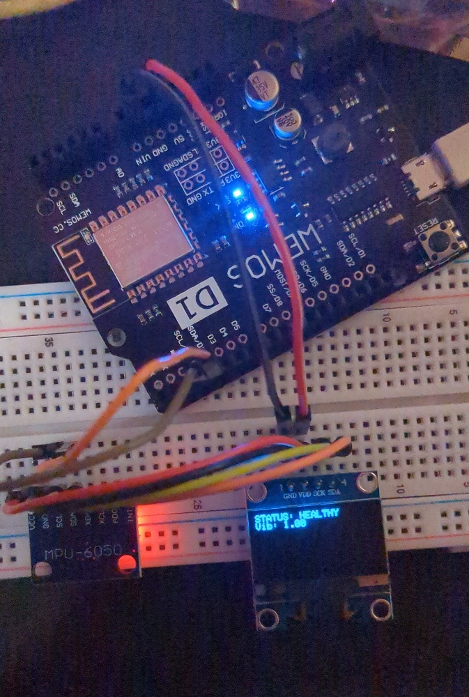
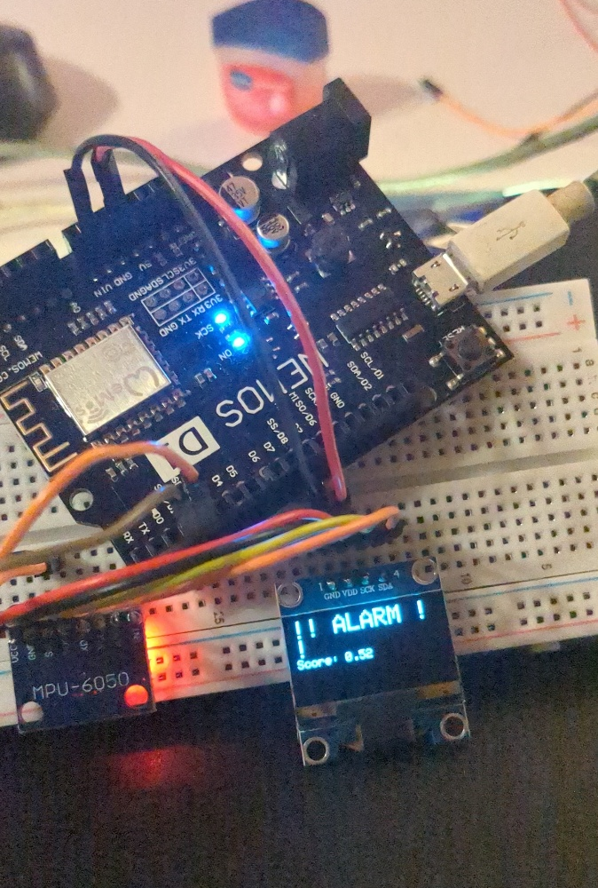
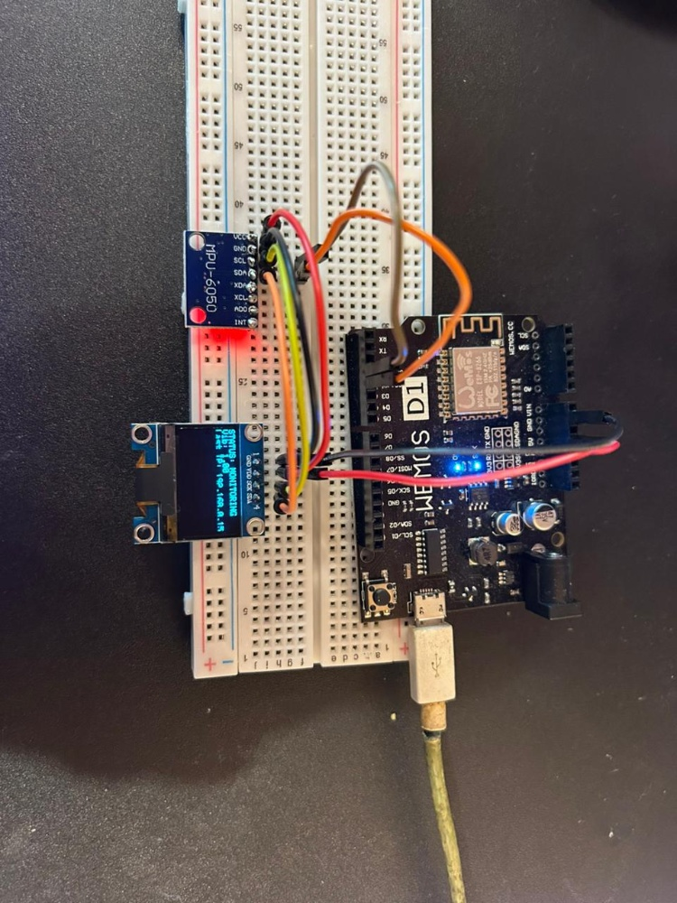

# IoT TinyML Vibration Anomaly Detector 🚀

An edge-computing sensor built with a **Wemos D1 (ESP8266)** and **MPU-6050** that learns "normal" machine vibration and sends cloud alerts when anomalies are detected. It uses statistical TinyML logic to determine baseline vibration levels without complex, power-hungry algorithms.

## 🧠 How it Works
1.  **Learning Phase:** Upon boot, the device takes 10 seconds to observe ambient vibration, calculating the mean and noise floor.
2.  **Inference:** It continuously monitors real-time acceleration magnitude.
3.  **Cloud Alert:** If an anomaly (deviation > threshold) is detected, it triggers a **Webhook** to the cloud and updates the local OLED.

| Device in Normal Operation | Device in Anomaly (Alarm) State |
| :--- | :--- |
|  |  |
| *Learning completed, baseline established.* | *External force detected, alert sent to Webhook.* |

## 🛠 Hardware Setup
The project uses the I2C bus to communicate with both the OLED display and the MPU-6050 sensor. The ESP8266 is configured in Station Mode to connect to Wi-Fi.

*Top-down view of the breadboard wiring connecting Wemos D1 to OLED and MPU-6050.*

### Bill of Materials (BOM)
* Wemos D1 R1 (ESP8266)
* MPU-6050 (Accelerometer/Gyro)
* 0.96" SSD1306 OLED Display (I2C)
* Breadboard and Jumper Wires

## 💻 Software & Libraries
This project was built with the Arduino IDE. The following libraries are required:
* `ESP8266WiFi` and `ESP8266HTTPClient` (for IoT connectivity)
* `Wire.h` and `MPU6050_light` (by rfetick) for sensor data
* `Adafruit_GFX` and `Adafruit_SSD1306` (for the OLED)